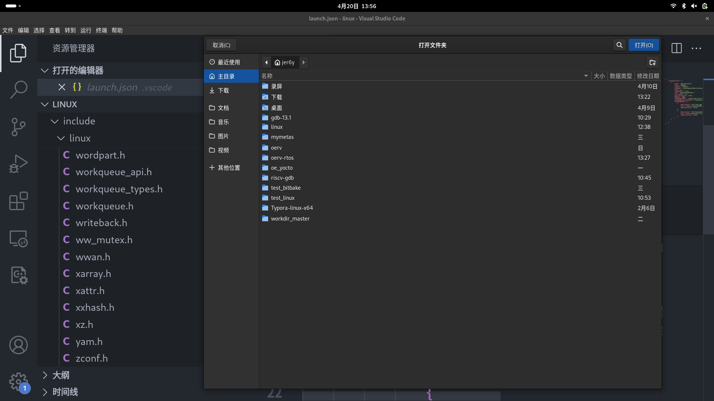
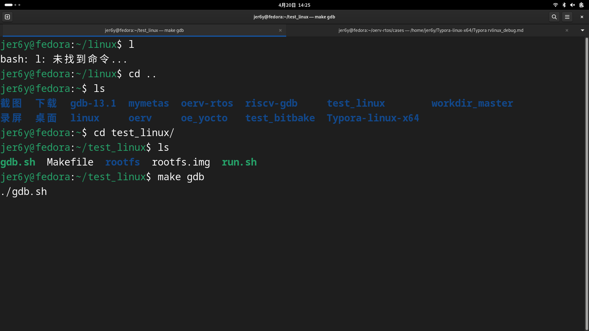
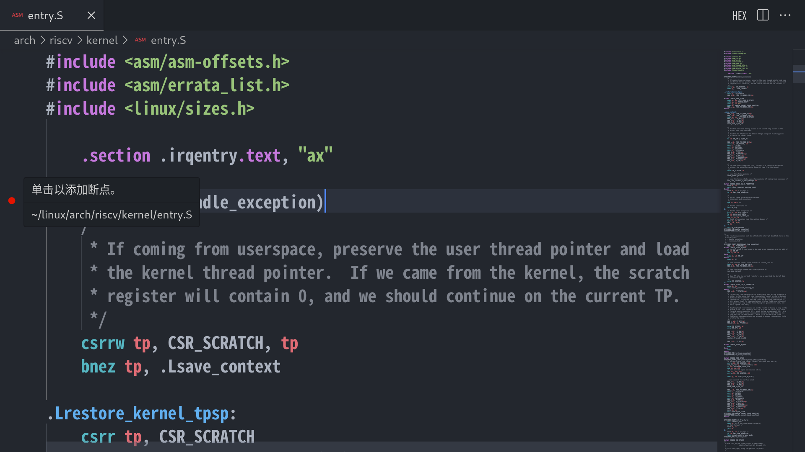
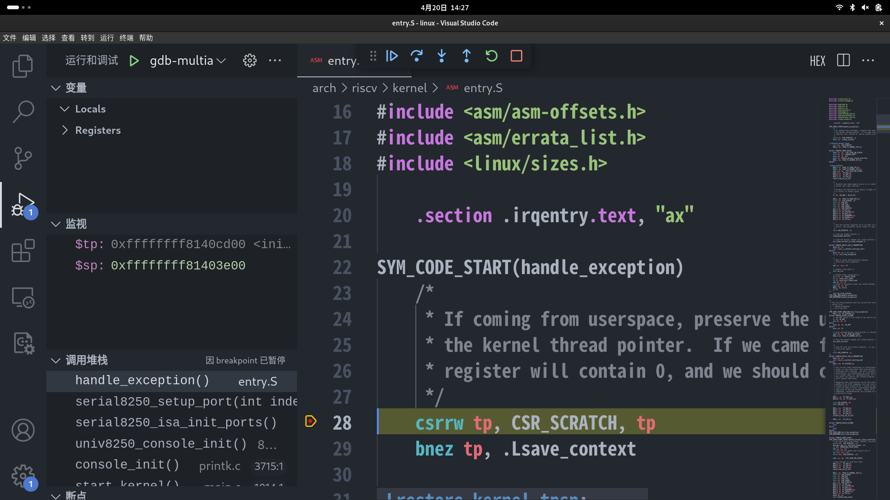

# 使用 VSCODE + QEMU + GDB 舒适的调试 RISCV Linux

## 前言

- 此处默认读者已知晓 **如何交叉编译RISCV LINUX** , **如何编译安装交叉编译工具链**,  **如何使用 busybox 制作简易根文件系统**, 并且已经能够**使用交叉GDB 在Host主力机上调试 RISCV Linux** 
- 您是否还为裸的GDB 图形界面 TUI 而困扰 
- 您是否想过肯定有办法有更好看的UI 和更便捷的形式帮助您阅读和调试 RISCV Linux Kernel
- 如果您曾经使用过 VSCODE 调试编译代码，您是否有想过利用 VSCODE 调试阅读 RISCV Linux Kernel
-  一切您想过的方便的工具和方法，多数情况下都会有人曾经也想过同时付诸于实践
- 在 KIMI AI 的帮助下，我完成了此篇章的内容，花了3个小时不到的时间，就让我调试 RISCV Linux Kernel 的效率提升了几倍，工欲善其事，必先利其器！

## 正文

### 下载安装VSCODE

- google 搜索安装即可

### 安装VSCODE 插件

- 安装插件 `C/C++ IntelliSense` 
- 安装插件 `RISC-V Support`  【可选，能够更舒适的阅读 .S 的 riscv code】

### 配置插件需要的 Json 文件

- 对于`C/C++ IntelliSense`  插件，用户可以编辑插件制定的特殊名的json格式的文件，来告诉插件，用户想要做什么，比如 `C/C++ IntelliSense`  插件会根据 `.vscode/launch.json` 文件来指定GDB所在的路径, GDB 运行时自动执行的命令等

- 使用VSCODE 打开Linux 源代码作为`工作目录` , 此处我需要打开的工作目录为 `linux`

- 

- 在工作目录下创建 .vscode 目录 , 和 launch.json 文件，这里我的工作目录是 `/home/jer6y/linux` 

  - ```shell
    mkdir .vscode
    touch .vscode/launch.json
    ```

- 复制下列 json 内容到 launch.json 文件里面 , 不难看出，我在这里默认需要先开启QEMU进程，再使用gdb 连接，否则会出现连接超时，你也可以选择询问 `KIMI AI` , 如何配置 json 文件，能够让我在启动 GDB 的时候自动启动QEMU ，同时结束的时候自动向 QEMU 进程发送 SIGKILL 信号

  - ```json
    {
        "configurations": [
            {
                "name": "gdb-multiarch", 
                "type": "cppdbg",
                "request": "launch",
                "program": "${workspaceFolder}/vmlinux", //指定运行gdb 时的 elf 文件, 可以看出这里需要你自己先编译Linux后,才能正常gdb
                "args": [],
                "stopAtEntry": true,
                "cwd": "${workspaceFolder}",
                "environment": [],
                "externalConsole": false,
                "MIMode": "gdb",
                "miDebuggerPath": "/home/jer6y/riscv-gdb/bin/riscv64-unknown-elf-gdb", //指定你的gdb 的路径，这里是我交叉gdb所在的路径，制定的gdb需要能够解析 riscv 的 elf
                "miDebuggerServerAddress": "localhost:1234", //指定gdb 连接的进程端口，这里我是会在本地开启qemu 的进程，在默认的1234端口等待 GDB 连接
                "setupCommands": [ //GDB 打开 vmlinux 后自动执行的命令
                    {
                        "description": "use linux gdb script",
                        "text": "source ${workspaceFolder}/vmlinux-gdb.py", //这个命令是因为我打开了编译 Linux Kernel 的提供gdb的脚本，这个脚本为GDB提供了很多函数对内核进行gdb , 如果没有打开这个选项，把这个命令删除
                        "ignoreFailures": false
                    },
                    {
                        "description": "Set Disassembly Flavor to RISC-V", //这个命令设置gdb的架构为rv64
                        "text": "set architecture riscv:rv64",
                        "ignoreFailures": false
                    }
                ]
            }
    
        ]
    }
    ```

- 完成上述配置之后，我们就完成了`点击开始调试` 之后，VSCODE 会帮我们干的事情，我们还需要配置一个 json ，来告诉 C/C++ 的插件，该如何解析内核的文件，【内核这么多的宏定义 , 这么多的include 路径，必须要根据我们编译的选项配置好】 

- 在 .vscode 目录下创建 `c_cpp_properties.json` 文件 ，任然是工作目录下

  - ```shell
    mkdir  .vsocde/c_cpp_properties.json
    ```

- 将下面的json 文件复制到 json 文件里面，并根据自己的需求进行修改

  - ```json
    {
        "configurations": [
            {
                "name": "Linux", //不用修改
                "includePath": [ //不用修改
                    "${workspaceFolder}/**"
                ],
                "defines": [], //不用修改
                "cStandard": "c17", //不用修改
                "cppStandard": "gnu++17", //不用修改
                "intelliSenseMode": "linux-gcc-x64", //自行修改，可百度搜索应该根据当前环境怎么改
                "configurationProvider": "ms-vscode.makefile-tools",
                "compilerPath": "/usr/bin/riscv64-linux-gnu-gcc", //编译器的路径
                "compileCommands": "${workspaceFolder}/compile_commands.json" //查看下面的解释
    
            }
        ],
        "version": 4
    }
    ```

- 其中 `"compileCommands": "${workspaceFolder}/compile_commands.json"` 这个参数非常重要

- 他指定来一个json 文件，这个json 文件可以告诉 C/C++ 插件如何解析当前工作目录下的所有文件 .c 或者 .s 等

- Linux Kernel 为我们提供了 python 脚本生成对应的 json 文件 ， 在 Linux 的根目录下执行

  - ```shell
    python ./scripts/clang-tools/gen_compile_commands.py
    ```

  - 这个脚本会在当前目录生成 compile_commands.json 文件

- 至此，你已经完成了所有配置

### 体验 RISCV Linux VSCODE

- 先开启 qemu 进程，等待 gdb 在TCP 1234端口连接
- 
- 在 `hanlde_exception` 函数处打断点
- 
- 开启调试 
- 
- 可以方便的看到函数调用堆栈，监视的变量，本地变量和寄存器，也可以调用GDB命令，查看一些地址空间等，当然还可以使用 编译linux提供的 gdb脚本的函数查看各种各样的信息，总之是比裸TUI界面爽的多了！