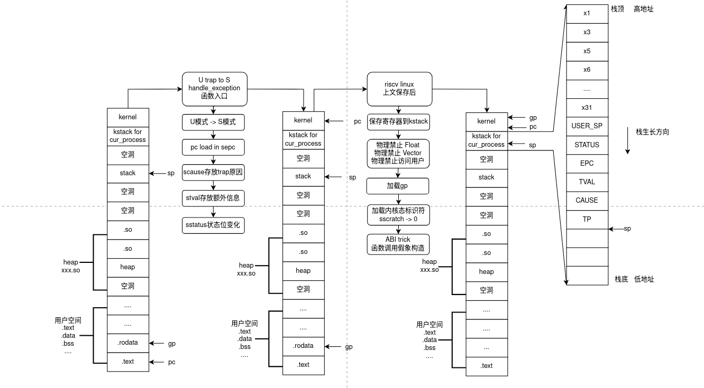
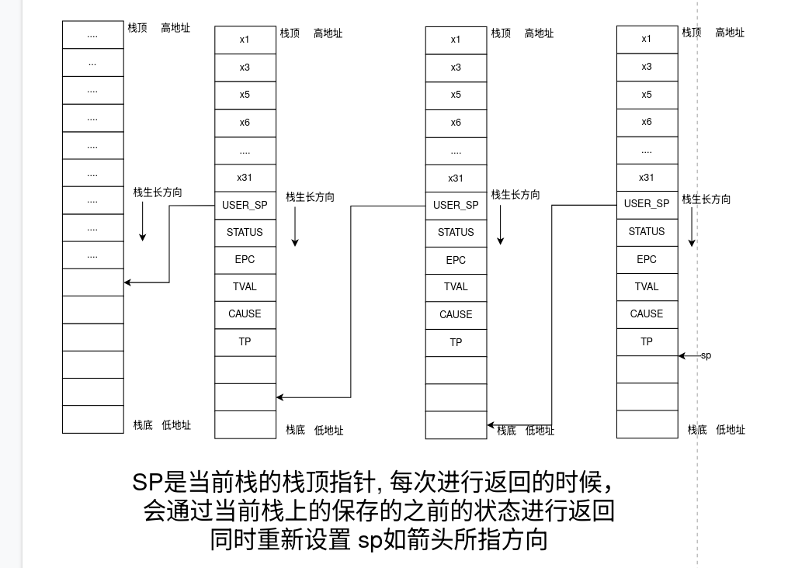

# RISCV UniProton 上下文切换 和  RISCV Linux 上下文切换详解【非常详细版本，每一行代码都会讲解】

# 前言

- **您需要对 RISCV 架构的 trap 模式很了解，在文章中默认您已经知道在发生trap 时，硬件自动的操作**
- 回顾一下 在 U 或者 S 模式时发生 trap 硬件会做什么操作，假设我们已经把 Trap 代理到了 S 模式
  - **pc 跳转到 stvec 寄存器所指的地址**
  - **sepc 被记录为 跳转之前的 pc**
  - **scause 放置有 具体trap 的原因**
  - **stval 放置有 发生trap 的额外的信息，比如如果是一个非法写内存地址导致的trap , stval 会放置导致trap发生的写入的地址**
  - **硬件被切换到 S 模式 【可以访问S模式的CSR了】**
  - **硬件切换之前的模式放到 sstatus 中的 SPP 域**
  - **sstatus中的 SIE 域清空** 【自动屏蔽所有中断】
  - **sstatus中的SPIE域设置为SIE清空前的状态** 【如果清空前SIE为1 表示允许中断，则SPIE为1 ，反之亦然, 这个状态主要是为了执行 sret 的时候用来标定 SIE 应该被刷新的状态】  

# RISCV Linux 的上下文切换

## 先决软件知识和架构知识

- 在 **RISCV Linux** 中， 某个**用户进程** 在**用户态运行**时，该进程的**PCB地址**会被放到**执行该进程的 CPU** 的 **sscratch** 寄存器中
- 在 **RISCV Linux** 中， 某个**用户进程** 在**内核态运行**时，该进程的**PCB地址**会被放到**执行该进程的 CPU** 的 **tp** 寄存器中 , 同时**sscratch**寄存器必须永远都是0
- **sscratch** 是 riscv 的s 态的一个 csr 寄存器，不允许 U 态的用户进程修改，同时又属于S态的一个 "临时寄存器" , 只是用来暂存数值。所以不用担心在 用户空间中被修改，同时也没有实际意义。
- Linux 进程在**内核态中是可以被中断**的 , 专业术语称为**可抢占式内核**
- **Linux 内核空间 禁止一切 浮点数相关的操作**
- **RISCV Linux 内核空间 禁止 对向量寄存器进行操作**
- **RISCV Linux 内核空间 默认禁止 对用户空间进行访问，如果需要访问，需要自行打开权限**
- 建议自行了解 **RISCV ABI** ， 了解**caller register**,  **callee register**
- 建议自行了解 **RISCV Linux 进程的地址空间映射图**

## 正式开始

- 一旦发生Trap 即需确定， **Trap From 用户态** ， **还是 Trap From 内核态**?  , **如何判断？** 

  - ```c
    SYM_CODE_START(handle_exception) //注意这段代码的函数名字叫 : handle_exception [在后面的讲解中会使用到]
    	/*
    	 * If coming from userspace, preserve the user thread pointer and load
    	 * the kernel thread pointer.  If we came from the kernel, the scratch
    	 * register will contain 0, and we should continue on the current TP.
    	 */
    	csrrw tp, CSR_SCRATCH, tp   // 交换 sscratch 寄存器 和 tp 寄存器
    	bnez tp, .Lsave_context     // 检查 tp 是否为0 ，本质是检查交换之前的 sscratch是否为0 
         // 为0   -> 说明是内核态触发的 trap  【交换前的tp寄存器为当前进程的pcb地址】
         // 不为0 -> 用户态触发的trap         【交换前的sscratch寄存器为当前进程的pcb地址】
    
    .Lrestore_kernel_tpsp:
    	csrr tp, CSR_SCRATCH       // 内核态触发的 trap，我们把交换后的sscratch 重新读回 tp
            				    //  现在tp为当前进程的pcb地址
    	REG_S sp, TASK_TI_KERNEL_SP(tp)  
         //
    
    ```

  - 之前有提到过 **内核态和用户态有一个很大的区别** ， 那就是 **SSCRATCH** 寄存器 

- **在正式开解读上下文切换保存之前，我需要两张图片来分别解释寄存器[所谓上文] 保存到了哪里**

  - **注意：关于栈中寄存器的顺序，并不是和图中所示一致，在riscv linux 中为每个寄存器的压栈顺序被宏替代了，这里只是参考保存了哪些寄存器 以及当前PCB的 kernel_stack 也并不一定如图所示，这里只是方便做讲解**

  - **需要留意一个很关键的点，理解这个点，将会理解无论是 U -> S 还是 S 被中断形成的 S -> S**

    - **在 PCB 中预留了两个临时的寄存器位置而不是在栈上保存的 ， 分别是 `TASK_TI_USER_SP` 和 `TASK_TI_KERNEL_SP`**
    - **听名字好像是一个保存用户栈的SP 一个保存 内核栈的 SP，但其实不是！TASK_TI_KERNEL_SP是保存trap时的可用的内核栈栈顶sp指针，而 TASK_TI_USER_SP 是临时保存当前栈顶SP的空间**
    - **您可能还是不是很理解我的意思，可以在阅读后续解析后，再回过头来看这句话，应该会更加清晰透彻了，同时也比较想吐槽一下这里这个名字设计的不是很合理，容易让人产生误会**

  - 让我们继续阅读源码

    - ```c
      SYM_CODE_START(handle_exception) //注意这段代码的函数名字叫 : handle_exception [在后面的讲解中会使用到]
      	/*
      	 * If coming from userspace, preserve the user thread pointer and load
      	 * the kernel thread pointer.  If we came from the kernel, the scratch
      	 * register will contain 0, and we should continue on the current TP.
      	 */
      	csrrw tp, CSR_SCRATCH, tp   // 交换 sscratch 寄存器 和 tp 寄存器
      	bnez tp, .Lsave_context     // 检查 tp 是否为0 ，本质是检查交换之前的 sscratch是否为0 
           // 为0   -> 说明是内核态触发的 trap  【交换前的tp寄存器为当前进程的pcb地址，现在是sscratch寄存器】
           // 不为0 -> 用户态触发的trap         【交换前的sscratch寄存器为当前进程的pcb地址，现在是tp寄存器】
      
      .Lrestore_kernel_tpsp: //跳过这两个指令，因为我们假设现在是从 U用户态跳转到S内核态的，下面的情况属于 S -> S的情况
      	csrr tp, CSR_SCRATCH    
           REG_S sp, TASK_TI_KERNEL_SP(tp)  
      
       #ifdef CONFIG_VMAP_STACK //忽略掉他，不用管
      	addi sp, sp, -(PT_SIZE_ON_STACK)
      	srli sp, sp, THREAD_SHIFT
      	andi sp, sp, 0x1
      	bnez sp, handle_kernel_stack_overflow
      	REG_L sp, TASK_TI_KERNEL_SP(tp)
      #endif
      
      .Lsave_context:  
      	REG_S sp, TASK_TI_USER_SP(tp)
           // 刚才提及的注意点！！！！！！！！！
           // 我们需要把 sp 寄存器，【现在还是用户栈顶，对应图中第二个状态】, 存放到 pcb 中的 TASK_TI_USER_SP 字段！！ 这是临时存放 sp 的地方，不要被名字迷惑了！！！！！！！
      	REG_L sp, TASK_TI_KERNEL_SP(tp)
           // 从pcb 中的 TASK_TI_KERNEL_SP 字段提取到 sp 寄存器中，TASK_TI_KERNEL_SP字段是保存trap时的可用的内核栈栈顶sp指针 ！！！
      	addi sp, sp, -(PT_SIZE_ON_STACK)
           // 在内核栈开辟空间
      	REG_S x1,  PT_RA(sp) // 保存 [x1/ra]
      	REG_S x3,  PT_GP(sp) // 保存 [x3/gp]
      	REG_S x5,  PT_T0(sp) // 保存 [x5/t0]
      	save_from_x6_to_x31  // 保存 [x6-x31]
          //注意: 不用保存 x0 , x0 是常量0 
          // x2 寄存器是 sp, 如果要保留，本意是想保留用户栈的sp ，刚才已经临时保留过一次
          // x4 是tp 寄存器，现在tp 寄存器已经和 sscratch 交换过，不要保存 tp!!!! ，而应该保存 sscratch 到 tp !!
          
          // ==================================================================
            /*
      	 * Disable user-mode memory access as it should only be set in the
      	 * actual user copy routines.
      	 *
      	 * Disable the FPU/Vector to detect illegal usage of floating point
      	 * or vector in kernel space.
      	 */
      	li t0, SR_SUM | SR_FS_VS
      	csrrc s1, CSR_STATUS, t0
          //================================================================
          // 上面在做下面两个步骤
          // 1. 先把sstatus寄存器放到s1 [s1已经被保存了在上面的x6-x31，可以直接使用，不用担心]
          // 2. 再把当前的sstatus的 sum/fs/vs域清空，就是禁止内核使用 F/D 浮点数指令 和 V向量指令， 
          // 以及不能修改 带有 U 权限的地址空间[默认不允许内核修改用户地址空间] 
              
      	REG_L s0, TASK_TI_USER_SP(tp)
           // 重点！！！！！ 刚才说过 PCB中的TASK_TI_USER_SP 字段 只是临时保存用户栈 sp 
           // 现在我们需要把他load 到s0 , 重新保存到当前的内核栈上
           
      	csrr s2, CSR_EPC  //load epc -> s2
      	csrr s3, CSR_TVAL //load tval -> s3
      	csrr s4, CSR_CAUSE // load cause -> s4
      	csrr s5, CSR_SCRATCH // load 用户的tp寄存器到s5 [这里在最开始已经做过交换了]
           //所以现在的 sscratch 寄存器是 用户的 tp 寄存器
      	
           //============================
           REG_S s0, PT_SP(sp)  
      	REG_S s1, PT_STATUS(sp)
      	REG_S s2, PT_EPC(sp)
      	REG_S s3, PT_BADADDR(sp)
      	REG_S s4, PT_CAUSE(sp)
      	REG_S s5, PT_TP(sp)
          //============================
          //上面是分别把几个寄存器存放到当前的内核栈上
      ```

  - **阅读完上述的源码 【角度 从 用户U模式 -> 内核 S模式的角度】 之后，再回过头看给出的图片**

  - **接下来是解析 内核态 S 态被中断实现 S -> S 的角度**

  - ```c
    SYM_CODE_START(handle_exception) //注意这段代码的函数名字叫 : handle_exception [在后面的讲解中会使用到]
    	/*
    	 * If coming from userspace, preserve the user thread pointer and load
    	 * the kernel thread pointer.  If we came from the kernel, the scratch
    	 * register will contain 0, and we should continue on the current TP.
    	 */
    	csrrw tp, CSR_SCRATCH, tp   // 交换 sscratch 寄存器 和 tp 寄存器
    	bnez tp, .Lsave_context     // 检查 tp 是否为0 ，本质是检查交换之前的 sscratch是否为0 
         // 为0   -> 说明是内核态触发的 trap  【交换前的tp寄存器为当前进程的pcb地址，现在是sscratch寄存器】
         // 不为0 -> 用户态触发的trap         【交换前的sscratch寄存器为当前进程的pcb地址，现在是tp寄存器】
    
    .Lrestore_kernel_tpsp: //现在不要忽略这段了，我们看看这段在干什么！！！
    	csrr tp, CSR_SCRATCH    
         // 把 tp 寄存器装载为 sscratch 寄存器，也就是交换前的tp寄存器
         // 交换前的tp寄存器是用来保存当前进程的pcb指针的
         REG_S sp, TASK_TI_KERNEL_SP(tp)  
         // 重点！！！！把当前的 sp 存进了 当前 pcb 的 TASK_TI_KERNEL_SP字段
         // 因为当前是 S 态 trap sp 本来就指向了内核栈
         // sp 是当前的栈顶指针，需要用来做存放trap时的可用内核栈顶sp ，也就是构造一个假的空栈！！
    
     #ifdef CONFIG_VMAP_STACK //忽略掉他，不用管
    	addi sp, sp, -(PT_SIZE_ON_STACK)
    	srli sp, sp, THREAD_SHIFT
    	andi sp, sp, 0x1
    	bnez sp, handle_kernel_stack_overflow
    	REG_L sp, TASK_TI_KERNEL_SP(tp)
    #endif
    
    .Lsave_context:  
    	REG_S sp, TASK_TI_USER_SP(tp)
         // 提及的注意点！！！！！！！！！
         // 我们需要把 sp 寄存器，【现在是当前的内核栈的某个栈顶 存放到 pcb 的 TASK_TI_KERNEL_SP字段！！！】
         // 所以我解释说 TASK_TI_USER_SP 字段是临时存放当前栈顶sp 的一个字段
    	REG_L sp, TASK_TI_KERNEL_SP(tp)
         // 加载 TASK_TI_KERNEL_SP 字段
         // 我们刚才已经保证了 TASK_TI_KERNEL_SP 字段是trap时的一个空栈
            
    	addi sp, sp, -(PT_SIZE_ON_STACK)
         // 在内核栈开辟空间
    	REG_S x1,  PT_RA(sp) // 保存 [x1/ra]
    	REG_S x3,  PT_GP(sp) // 保存 [x3/gp]
    	REG_S x5,  PT_T0(sp) // 保存 [x5/t0]
    	save_from_x6_to_x31  // 保存 [x6-x31]
        //注意: 不用保存 x0 , x0 是常量0 
        // x2 寄存器是 sp, 如果要保留，本意是想保留用户栈的sp ，刚才已经临时保留过一次
        // x4 是tp 寄存器，现在tp 寄存器已经和 sscratch 交换过，不要保存 tp!!!! ，而应该保存 sscratch 到 tp !!
        
        // ==================================================================
          /*
    	 * Disable user-mode memory access as it should only be set in the
    	 * actual user copy routines.
    	 *
    	 * Disable the FPU/Vector to detect illegal usage of floating point
    	 * or vector in kernel space.
    	 */
    	li t0, SR_SUM | SR_FS_VS
    	csrrc s1, CSR_STATUS, t0
        //================================================================
        // 上面在做下面两个步骤
        // 1. 先把sstatus寄存器放到s1 [s1已经被保存了在上面的x6-x31，可以直接使用，不用担心]
        // 2. 再把当前的sstatus的 sum/fs/vs域清空，就是禁止内核使用 F/D 浮点数指令 和 V向量指令， 
        // 以及不能修改 带有 U 权限的地址空间[默认不允许内核修改用户地址空间] 
            
    	REG_L s0, TASK_TI_USER_SP(tp)
         // 重点！！！！！ 刚才说过 PCB中的TASK_TI_USER_SP 字段 只是临时保存旧栈的sp 
         // 现在我们需要把他load 到s0 , 重新保存到当前的新内核栈上
         
    	csrr s2, CSR_EPC  //load epc -> s2
    	csrr s3, CSR_TVAL //load tval -> s3
    	csrr s4, CSR_CAUSE // load cause -> s4
    	csrr s5, CSR_SCRATCH // load 用户的tp寄存器到s5 [这里在最开始已经做过交换了]
         //所以现在的 sscratch 寄存器是 用户的 tp 寄存器
    	
         //============================
         REG_S s0, PT_SP(sp)  
    	REG_S s1, PT_STATUS(sp)
    	REG_S s2, PT_EPC(sp)
    	REG_S s3, PT_BADADDR(sp)
    	REG_S s4, PT_CAUSE(sp)
    	REG_S s5, PT_TP(sp)
        //============================
        //上面是分别把几个寄存器存放到当前新内核栈上
    ```

- **看完两段代码后，可能会有点晕，现在再重新回头看那张图片，同时我再通过下面的图片进行总结，就会恍然大悟**

  - 

- **继续往下读，我们已经把状态全部保存到了新栈上面，我们需要加载 gp , 重新设置 sscratch ，然后利用ABI trick 了**

  - ```c
    SYM_CODE_START(handle_exception)
    	.......
    	REG_S s5, PT_TP(sp)
    
    	/*
    	 * Set the scratch register to 0, so that if a recursive exception
    	 * occurs, the exception vector knows it came from the kernel
    	 */
    	csrw CSR_SCRATCH, x0 //加载内核态标识符 sscratch -> 0 
    
    	/* Load the global pointer */
    	load_global_pointer //加载内核态的 global_pointer
    
    	/* Load the kernel shadow call stack pointer if coming from userspace */
    	scs_load_current_if_task_changed s5 //忽略掉他
    
    #ifdef CONFIG_RISCV_ISA_V_PREEMPTIVE //忽略掉他
    	move a0, sp
    	call riscv_v_context_nesting_start
    #endif
        
        //下面要开始利用ABI trick 制作假象了 
        // ============================================ 
    	move a0, sp /* pt_regs */
        // 通过 a0 , 把当前栈顶 sp 传给 trap_handler 相关的函数 [ABI 规定的传参方法]
        // 而当前的sp 查阅图片，确实是一堆寄存器
        // 刚好就是 struct pt_regs 结构体指针了，直接作为参数传递过去
    
    	la ra, ret_from_exception
        // 通过 ra , 制作一个假象: 是从地址 ret_from_exception 跳转过来的
        // 就是说： 进行 return 会直接 return 到 ret_from_exception 这个函数去
        
    	/*
    	 * MSB of cause differentiates between
    	 * interrupts and exceptions
    	 */
    	bge s4, zero, 1f
        //判断是中断还是异常，我们以中断为例子来看 
        //就是直接顺着走下去了
    	/* Handle interrupts */
    	tail do_irq
        // 中断 这里直接 等价于 j do_irq 无条件跳转了
        // 中断处理是不会返回到这里的，会返回到ret_from_exception，因为刚才说了， 利用ra制作了ABI trick
        // 同理你需要理解一个点，在j do_irq 之前， sp 是指向 保存的寄存器的栈顶的
        // 根据 ABI 规定， sp 作为一个 callee 寄存器，调用的函数是有责任必须保证调用前和调用后是不变的，
        // 也就是说 do_irq 返回后
        // 1. 返回的是函数 ret_from_exception
        // 2. sp 不会变
        1:
    	/* Handle other exceptions */
    	slli t0, s4, RISCV_LGPTR
    	la t1, excp_vect_table
    	la t2, excp_vect_table_end
    	add t0, t1, t0
    	/* Check if exception code lies within bounds */
    	bgeu t0, t2, 1f
    	REG_L t0, 0(t0)
    	jr t0
    	1:
    	tail do_trap_unknown
    	SYM_CODE_END(handle_exception)
    	ASM_NOKPROBE(handle_exception)
    
    ```

- **我们终于要走到最后了，函数返回 ret_from_exception**

- **继续看下面的代码**

  - ```c
    /*
     * The ret_from_exception must be called with interrupt disabled. Here is the
     * caller list:
     *  - handle_exception
     *  - ret_from_fork
     */
    SYM_CODE_START_NOALIGN(ret_from_exception) 
    	REG_L s0, PT_STATUS(sp)
    // 首先， 就和我们刚才分析的是一样的
    // 现在的 sp 直接是指向上一个执行流状态的寄存器
    // 现在我们先检查他的 sstatus 
    
    #ifdef CONFIG_RISCV_M_MODE // 没有配置 m模式，不用看 直接看else 部分
    	/* the MPP value is too large to be used as an immediate arg for addi */
    	li t0, SR_MPP
    	and s0, s0, t0
    #else
        
    	andi s0, s0, SR_SPP
    	//检查 spp ，看一下trap前是 U 模式trap过来的还是 S模式trap过来的
        
     #endif
    	
        bnez s0, 1f
        //不为0，就说明是S模式 trap过来的，直接跳过下面的指令到 标号 "1"
        
        
    	/* Save unwound kernel stack pointer in thread_info */
    	addi s0, sp, PT_SIZE_ON_STACK
        
    	REG_S s0, TASK_TI_KERNEL_SP(tp)
    	// 这两句是重新为用户态程序放好内核栈sp
         // 因为我们要返回用户态了，必须把下一次用户态trap 的sp放好
         // 这里有点微妙的是 ： 内核态被trap 每次自己会重新设置下一次trap 的sp
         // 但是用户态被 trap 不会，所以我们在返回时需要设置好下一次用户态trap的内核栈sp
        
        
        
    	/* Save the kernel shadow call stack pointer */
    	scs_save_current //忽略不看
    	/*
    	 * Save TP into the scratch register , so we can find the kernel data
    	 * structures again.
    	 */
    	csrw CSR_SCRATCH, tp
        // 要保证用户态的 sscratch 必须是当前执行的 pcb 的地址
        
    1:
    //不为0直接会跳到这里
    #ifdef CONFIG_RISCV_ISA_V_PREEMPTIVE //忽略不看
    	move a0, sp
    	call riscv_v_context_nesting_end
    #endif
    	REG_L a0, PT_STATUS(sp)  
    	/*
    	 * The current load reservation is effectively part of the processor's
    	 * state, in the sense that load reservations cannot be shared between
    	 * different hart contexts.  We can't actually save and restore a load
    	 * reservation, so instead here we clear any existing reservation --
    	 * it's always legal for implementations to clear load reservations at
    	 * any point (as long as the forward progress guarantee is kept, but
    	 * we'll ignore that here).
    	 *
    	 * Dangling load reservations can be the result of taking a trap in the
    	 * middle of an LR/SC sequence, but can also be the result of a taken
    	 * forward branch around an SC -- which is how we implement CAS.  As a
    	 * result we need to clear reservations between the last CAS and the
    	 * jump back to the new context.  While it is unlikely the store
    	 * completes, implementations are allowed to expand reservations to be
    	 * arbitrarily large.
    	 */
    	REG_L  a2, PT_EPC(sp)
    	REG_SC x0, a2, PT_EPC(sp)
    
    	csrw CSR_STATUS, a0
    	csrw CSR_EPC, a2
         // 重新把 sstatus  sepc 按照栈内的设置好
    
    	REG_L x1,  PT_RA(sp)
    	REG_L x3,  PT_GP(sp)
    	REG_L x4,  PT_TP(sp)
    	REG_L x5,  PT_T0(sp)
         //重新load x1 x3 x4 x5
         // x2 是 sp 最后来load
    	restore_from_x6_to_x31
         // 重新load x6 - x31
    
    	REG_L x2,  PT_SP(sp)
         //最后load sp
    
    #ifdef CONFIG_RISCV_M_MODE
    	mret
    #else
    	sret 
         // 执行sret
    #endif
    SYM_CODE_END(ret_from_exception)
    ASM_NOKPROBE(ret_from_exception)
    
    ```

## RISCV Linux 上下文切换

- 总的来说，过程很绕，需要耐心下来仔细看
- 希望我的讲解能给您带来一些帮助

# UniProton RISCV 上下文切换